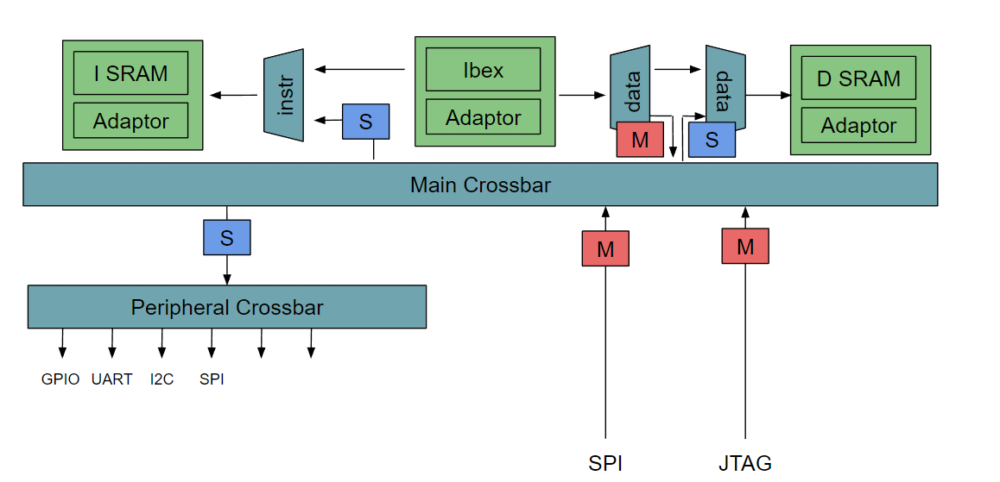

# Intel16-OpenTitanSoC

Major directories are listed below, the diagram is generated with `tree`:

- `sim` : RTL simulations and related scripts
- `hw`  : RTL sources
- `sw`  : software sources
- `syn` : build directory for synthesis
- `apr` : build directory for place & route
```
├── sim
│   ├── common
│   ├── post_apr
│   ├── post_apr_unit
│   ├── post_syn
│   ├── post_syn_unit
│   ├── pre_syn
│   └── pre_syn_unit
├── hw
│   ├── sv
│   └── tb
├── sw
│   ├── common
│   ├── hex
│   ├── src_asm
│   ├── src_c
│   └── test_data
├── syn
└── apr
```

# Setup

### Clone repository and submodules
-----------------------------------------------------------

Clone the repo and init all submodules
```
git clone git@github.com:minghungumich/Intel16-OpenTitanSoC.git
cd Intel16-OpenTitanSoC
./tools.sh --init
```

### Initialize vlsipool environment (K machine only)
-----------------------------------------------------------

Source `modules.sh` before doing any development or tool work. This will clear any other preloaded modules, so be sure to source other overriding module scripts after that. Remember to validate `eecstokens` before proceeding.
```
source modules.sh
```

# SoC Overview

### SoC block diagram
-----------------------------------------------------------



### Memory mapping
-----------------------------------------------------------

|             | Start Address | End Address |
| ----------- | ------------- | ----------- |
| Inst SRAM   | 0x0000_0000   | 0x0fff_ffff |
| Data SRAM   | 0x2000_0000   | 0x2fff_ffff |
| UART        | 0x3000_0000   | 0x3000_ffff |
| GPIO        | 0x3001_0000   | 0x3001_ffff |
| SPI         | 0x3002_0000   | 0x3002_ffff |
| I2C         | 0x3003_0000   | 0x3003_ffff |
| PLIC        | 0x3005_0000   | 0x3005_ffff |

# Running simulations

Current top level test structure supports SPI program loading and GPIO output. To run the top core simulation, type
```
cd sim/pre-syn
make
```
